# Your AI Postgraduate

<p align="right">
  <a href="./README.md"><kbd><b>English</b></kbd></a>
  <a href="./README_CN.md"><kbd>简体中文</kbd></a>
</p>

A Codex Skill ecosystem for long-running academic research. It packages the research automation workflow already used in practice into **one parent Skill, one shared governance Skill, and 21 operational child Skills**, covering idea ingestion, literature search, full-text reading, BibTeX, paper memory, causal knowledge, RAG, knowledge visualization, task-fit profiling, cost auditing, quality control, and Git synchronization.

This repository documents and publishes existing methods only. It does not introduce a new research methodology, and it contains no private research projects, paper full text, API credentials, or historical request logs.

## Scope

This system is designed to:

- create an independent `Postgraduate_<EnglishDomainSlug>` Obsidian vault for each research domain;
- turn IDEA notes, paper metadata, and lawfully acquired full text into traceable research knowledge;
- preserve authors, affiliations, source, URL, DOI, citation key, and BibTeX for every paper;
- read full papers strictly and extract research questions, methods, variables, datasets, experiments, findings, limitations, mechanisms, support, counterevidence, contrarian hypotheses, and validation experiments;
- build evidence-aware causal knowledge, compact paper memory, and provider-neutral JSONL RAG artifacts;
- assign strong, medium, and weak models by task while auditing requests, tokens, retries, latency, and failed units;
- continuously version permitted artifacts through Git.

This system is not designed to:

- treat abstracts, search snippets, or model guesses as verified full-text evidence;
- grant redistribution rights for papers automatically;
- label machine review as human verification;
- describe an association as a causal effect without an identifying design;
- publish private ideas, source corpora, PDFs, private endpoints, or credentials automatically.

## Architecture

```mermaid
flowchart TD
    P[your-ai-postgraduate\nParent Skill] --> C[postgraduate-common\nGovernance and artifact contracts]
    P --> I[Idea and domain layer]
    P --> L[Literature and full-text layer]
    P --> M[Memory and evidence layer]
    P --> K[Causal knowledge and synthesis layer]
    P --> R[Relations and RAG layer]
    P --> O[Profile, models, cost, quality, and Git]

    I --> I1[domain-router]
    I --> I2[vault-scaffolder]
    I --> I3[idea-ingestor]
    I --> I4[autoresearch]
    L --> L1[literature-search]
    L --> L2[fulltext-acquirer]
    L --> L3[bibliography-manager]
    L --> L4[deep-reader]
    M --> M1[paper-memory]
    M --> M2[evidence-validator]
    M --> M3[hyperextract-adapter]
    K --> K1[causal-builder]
    K --> K2[corpus-synthesizer]
    R --> R1[relation-builder]
    R --> R2[rag-builder]
    R --> R3[rag-reasoner]
    O --> O1[knowledge-profiler]
    O --> O2[model-tier-controller]
    O --> O3[cost-auditor]
    O --> O4[quality-auditor]
    O --> O5[git-sync]
```



The parent Skill identifies the current stage, enforces gates, and routes work. It does not expand every method in one context. Detailed policies live under `postgraduate-common/references/`, and operational Skills load them only when needed.

## Skill Catalog

| Skill | Responsibility |
| --- | --- |
| `your-ai-postgraduate` | Identify the research stage, enforce gates, and coordinate the complete workflow |
| `postgraduate-common` | Govern naming, evidence, artifacts, privacy, model tiers, and routing contracts |
| `postgraduate-domain-router` | Route research material into an independent domain vault |
| `postgraduate-vault-scaffolder` | Create an Obsidian-ready domain knowledge base |
| `postgraduate-idea-ingestor` | Import one or more IDEA Markdown files |
| `postgraduate-autoresearch` | Produce literature maps and evidence-backed idea variants |
| `postgraduate-literature-search` | Search, screen, expand, and connect scholarly literature |
| `postgraduate-fulltext-acquirer` | Lawfully acquire PDF/full text and OCR scanned documents |
| `postgraduate-bibliography-manager` | Preserve, correct, and validate BibTeX and citation metadata |
| `postgraduate-deep-reader` | Perform strict full-text reading and causal extraction |
| `postgraduate-paper-memory` | Build compact, resumable, source-grounded paper memories |
| `postgraduate-evidence-validator` | Validate quotations, claims, and causal wording against source chunks |
| `postgraduate-causal-builder` | Build variables, mechanisms, claims, hypotheses, and causal bridges |
| `postgraduate-corpus-synthesizer` | Consolidate a complete paper corpus into durable knowledge pages |
| `postgraduate-relation-builder` | Generate Obsidian relations and semantic paper clusters |
| `postgraduate-rag-builder` | Produce provider-neutral JSONL RAG corpora |
| `postgraduate-rag-reasoner` | Retrieve, rehydrate, and reason across validated paper evidence |
| `postgraduate-knowledge-profiler` | Visualize acquired knowledge and rank current research-task fit |
| `postgraduate-hyperextract-adapter` | Run optional exhaustive Hyper-Extract graph extraction and validation |
| `postgraduate-model-tier-controller` | Assign and audit strong, medium, and weak models by task |
| `postgraduate-cost-auditor` | Audit requests, tokens, retries, latency, failures, and budgets |
| `postgraduate-quality-auditor` | Check corpus completeness, evidence, metadata, and RAG usability |
| `postgraduate-git-sync` | Commit and synchronize permitted artifacts with explicit comments |

## Existing Workflow

```text
IDEA
  -> domain routing and vault initialization
  -> literature search, screening, and paper master
  -> lawful full text, OCR, and BibTeX
  -> strict full-text paper cards
  -> compact paper memory
  -> quotation and claim-support validation
  -> variables, mechanisms, causal claims, hypotheses, and corpus synthesis
  -> Obsidian relations and JSONL RAG
  -> retrieval, source rehydration, and cross-paper research reasoning
  -> knowledge visualization and current task-fit profile
  -> cost and quality audit
  -> Git commit and synchronization
```

Every stage writes resumable artifacts. Long papers are saved as independent parts, and only failed units are retried. Paper cards, paper masters, PDFs, full text, and BibTeX remain the authoritative literature layer. Compact paper memory is the default machine recall layer; Hyper-Extract is an optional exhaustive lower-level extractor.

## Artifact Layout

```text
Postgraduate_<EnglishDomainSlug>/
  .obsidian/
  .raw/                       # Immutable source material; private by default
  wiki/
    index.md
    hot.md
    log.md
    ideas/
    papers/
    datasets/
    variables/
    mechanisms/
    interventions/
    causal-core/
    causal-bridges/
    claims/
    hypotheses/
    gaps/
    sources/
    surveys/
    relations/semantic/
    profile/
  rag/
    corpus.jsonl
    paper-memory/
    postgraduate-profile.json
```

Every paper card must preserve authors, affiliations, year/source, URL, DOI, citation key, BibTeX, full-text state, evidence level, causal state, and local source paths. Derived memory or graph artifacts must never overwrite this metadata.

## Installation

Requirements: Git and Python 3.11+. Obsidian is optional. Install OCR and PDF system tools only when needed.

```bash
git clone git@github.com:Haoran-98/Your_AI_Postgraduate.git
cd Your_AI_Postgraduate

python -m venv .venv
. .venv/bin/activate
python -m pip install --upgrade pip
python -m pip install -r requirements.txt

export YOUR_AI_POSTGRADUATE_HOME="$PWD"
export RESEARCH_ROOT="${RESEARCH_ROOT:-$HOME/auto-research}"
mkdir -p "$RESEARCH_ROOT"
```

Link the Skill directories into Codex:

```bash
CODEX_SKILLS="${CODEX_HOME:-$HOME/.codex}/skills"
mkdir -p "$CODEX_SKILLS"
for skill in "$YOUR_AI_POSTGRADUATE_HOME"/skills/*; do
  destination="$CODEX_SKILLS/$(basename "$skill")"
  [ -e "$destination" ] || ln -s "$skill" "$destination"
done
```

If a Skill with the same name already exists, compare it manually instead of overwriting local changes.

## API Configuration

The scripts use OpenAI-compatible LLM and embedding endpoints. Copy the blank template and fill it locally. `auth` is excluded by `.gitignore`:

```bash
cp auth.example auth
# Load the completed auth file into the current shell.
set -a
. ./auth
set +a
```

The three LLM model IDs represent task strengths:

- `OPENAI_MEDIUM_MODEL_ID`: paper extraction, long-paper consolidation, and claim-support review;
- `OPENAI_STRONG_MODEL_ID`: retrieved cross-paper synthesis and research reasoning;
- `OPENAI_WEAK_MODEL_ID`: controlled same-paper cost comparisons only, disabled for production extraction by default;
- `EMBEDDING_MODEL_ID`: Hyper-Extract indexing and retrieval that requires embeddings.

Production extraction should explicitly pass `--model-strength medium`. Escalate to a strong model only after the medium model fails on the same independently saved unit and the failed attempt has been recorded.

## Quick Start

Create a domain vault:

```bash
python scripts/scaffold_postgraduate_vault.py \
  --root "$RESEARCH_ROOT" \
  --domain "Example Domain"
```

Prepare provider-neutral RAG artifacts:

```bash
python scripts/prepare_rag_corpus.py \
  --root "$RESEARCH_ROOT" \
  --vault Postgraduate_Example_Domain \
  --fulltext-only

python scripts/search_rag_corpus.py \
  "research question" \
  --corpus "$RESEARCH_ROOT/Postgraduate_Example_Domain/rag/corpus.jsonl"
```

Run compact paper-memory extraction for one paper:

```bash
python scripts/run_paper_memory_pipeline.py \
  --root "$RESEARCH_ROOT" \
  --vault Postgraduate_Example_Domain \
  --paper-id P01 \
  --model-strength medium
```

Retrieve paper memory. Add `--chat` only when strong-model synthesis is required:

```bash
python scripts/query_paper_memory_rag.py \
  Postgraduate_Example_Domain \
  "Which evidence supports or refutes this idea?" \
  --root "$RESEARCH_ROOT" \
  --top-k 8
```

Generate relation layers:

```bash
python scripts/generate_vault_relations.py --root "$RESEARCH_ROOT"
python scripts/generate_semantic_relations.py --root "$RESEARCH_ROOT"
```

Generate a post-research knowledge profile without an LLM:

```bash
python scripts/generate_postgraduate_profile.py \
  --root "$RESEARCH_ROOT" \
  --vault Postgraduate_Example_Domain \
  --language en
```

Additional operations are defined by each Skill's `SKILL.md` and the policies under `postgraduate-common/references/`.

## Evidence Levels

- `verified-fulltext`: readable full text has entered the strict reading workflow;
- `blocked`: bibliography and relevance are retained, but the paper cannot support verified claims;
- `exact`: the evidence quotation is a contiguous normalized match in the original chunk;
- `layout-recovered`: deterministic ordered-token recovery repaired layout extraction, but claim-support review is still required;
- `unmatched`: the record must not enter validated memory;
- `machine-reviewed`: a model checked the source, which is not equivalent to `human-verified`.

Causal wording is classified as `reported_association`, `author_causal_claim`, `identified_causal_effect`, or `mechanistic_hypothesis`. A directed causal edge may be emitted only when its source memory has passed validation.

## Knowledge Profile

After a substantial research pass, `postgraduate-knowledge-profiler` consolidates the stored results into:

- an Obsidian Markdown profile showing knowledge types and source links;
- a standalone HTML dashboard showing six readiness dimensions and ranked task fit;
- a JSON profile that downstream tools can inspect;
- a recommendation for the research task types best supported by the current artifacts.

The six dimensions are literature foundation, evidence grounding, method and empirical knowledge, causal reasoning, synthesis and innovation, and retrieval readiness. Recommendations are calculated from transparent fixed weights without an LLM. They describe current artifact readiness, not permanent ability, scientific novelty, or autonomous research competence.

## Hyper-Extract

[Hyper-Extract](https://github.com/yifanfeng97/hyper-extract) is an optional lower-level extractor in this system. It can produce more exhaustive nodes and edges, but it does not replace paper cards, compact memory, or evidence validation. Graph elements with unmatched quotations, missing endpoints, or unsupported causal strength must be rejected or downgraded.

Compact paper memory remains the default research recall layer because it preserves important knowledge, source locations, and bibliography while reducing repeated extraction tokens. Run Hyper-Extract only when a fine-grained knowledge graph is actually required.

## Validation And Tests

```bash
python -m compileall -q scripts
python -m pytest -q

for skill in skills/*; do
  python "${CODEX_HOME:-$HOME/.codex}/skills/.system/skill-creator/scripts/quick_validate.py" "$skill"
done
```

Before committing, also scan for absolute user paths, secrets, private URLs, paper full text, PDFs, request payloads, and private ideas. `.gitignore` is the last line of defense against accidental publication, not a replacement for manual review.

## Git Synchronization

Use an explicit commit comment for every permitted update:

```bash
scripts/sync_with_comment.sh \
  "Update paper memory workflow" \
  "Document the validated extraction and cost audit changes."
```

## Privacy And Copyright

This repository does not contain:

- API keys, authorization headers, cookies, or private endpoints;
- private drafts, unpublished ideas, personal notes, or confidential datasets;
- PDFs or full text without redistribution rights;
- model request/response logs containing private source text;
- machine usernames, absolute home paths, or user project vaults.

Users are responsible for verifying the licenses of papers, datasets, models, and generated artifacts.

## License

Repository-owned code, Skill instructions, generic templates, and documentation are released under the [MIT License](LICENSE). Third-party projects and scholarly materials remain subject to their own licenses and copyright terms.
