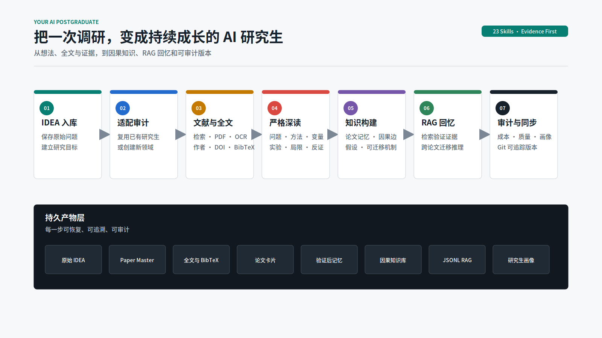
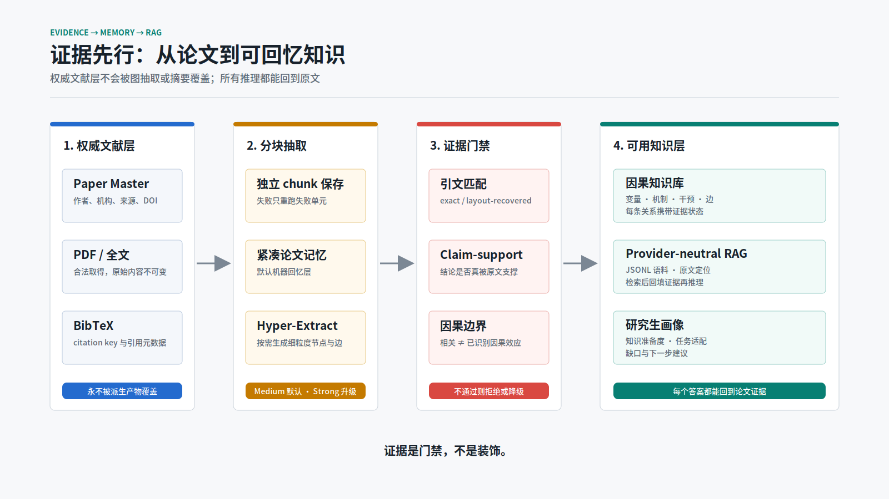
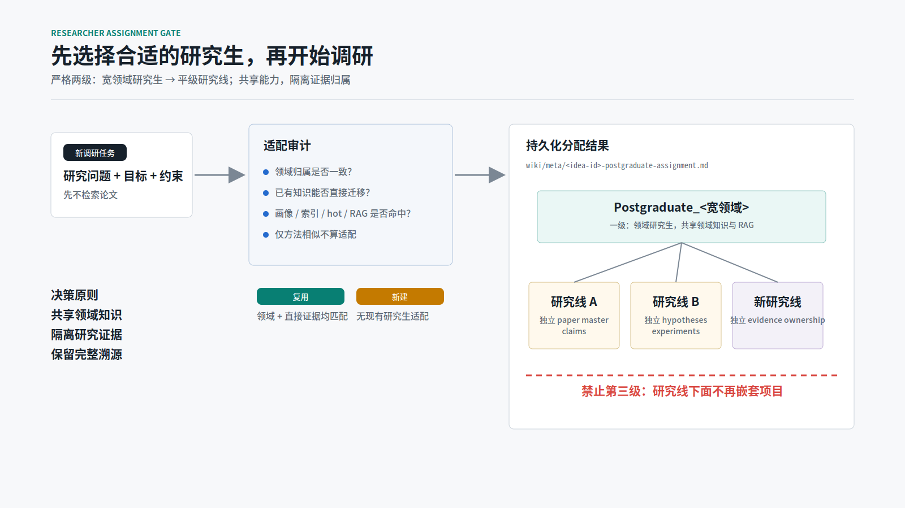

<div align="center">

# Your AI Postgraduate

### 让每一次调研，都沉淀为一个会积累证据、能够回忆、持续成长的 AI 研究生

[](./skills)
[](./requirements.txt)
[](#证据不是装饰而是门禁)
[](#最终会得到什么)
[](./LICENSE)

<a href="https://github.com/Haoran-98/Your_AI_Postgraduate/raw/main/release/your-ai-postgraduate-skills-v0.2.0.zip"></a>

</div>

<p align="right">
  <a href="./README.md"><kbd><b>简体中文</b></kbd></a>
  <a href="./README_EN.md"><kbd>English</kbd></a>
</p>

[](./docs/assets/system-workflow-zh.svg)

`Your AI Postgraduate` 是一套可公开安装的 Codex Skill 体系。它不只生成一次性综述，而是把 IDEA、论文元数据、合法全文、严格深读、证据验证、因果知识、RAG、研究生画像、成本审计和 Git 版本串成可恢复的长期科研工作流。

当前发行版包含 **1 个父 Skill、1 个公共治理 Skill、21 个执行子 Skill**。仓库只公开通用方法、脚本和模板，不包含私人研究项目、论文全文、API 凭据或历史请求日志。

## 为什么需要它

普通的 AI 调研常停在一份报告：下一次提问时，论文里的变量、实验、反证和局限又要重新读取。

这个系统把调研结果变成可持续使用的研究资产：

- **记得论文**：作者、机构、来源、URL、DOI、citation key 和 BibTeX 始终保留；
- **读到正文**：摘要和搜索片段不能冒充全文证据；
- **记得为什么**：保存研究问题、方法、变量、数据集、实验、发现、局限、机制、支撑与反证；
- **能回到原文**：RAG 检索后先回填来源证据，再做跨论文推理；
- **会选择方向**：知识画像显示当前擅长什么、缺什么、适合继续研究什么；
- **算得清成本**：按任务使用 strong / medium / weak 模型，并记录 token、重试和失败单元；
- **不会丢进度**：每个阶段写入持久产物，失败只重跑失败 chunk，Git 保存允许公开的版本。

## 立即安装

### 一条命令

安装脚本会把公开仓库克隆到 `$HOME/.local/share/Your_AI_Postgraduate`，再将 23 个 Skill 安全链接到 `${CODEX_HOME:-$HOME/.codex}/skills`。已有同名目录不会被覆盖。

```bash
curl -fsSL https://raw.githubusercontent.com/Haoran-98/Your_AI_Postgraduate/main/install.sh | sh
```

安装后重启 Codex，使新 Skill 出现在新的会话中。

### 直接下载 Skill Bundle

下载 [your-ai-postgraduate-skills-v0.2.0.zip](https://github.com/Haoran-98/Your_AI_Postgraduate/raw/main/release/your-ai-postgraduate-skills-v0.2.0.zip)，然后：

```bash
unzip your-ai-postgraduate-skills-v0.2.0.zip
cd Your_AI_Postgraduate
sh install.sh --source "$PWD"
```

校验下载内容：

```bash
curl -fsSLO https://raw.githubusercontent.com/Haoran-98/Your_AI_Postgraduate/main/release/SHA256SUMS
sha256sum -c SHA256SUMS
```

### 从源码安装

```bash
git clone https://github.com/Haoran-98/Your_AI_Postgraduate.git
cd Your_AI_Postgraduate
sh install.sh --source "$PWD"
```

需要复制而不是软链接时使用 `--copy`。安装器不会覆盖现有同名 Skill，冲突必须人工比较后处理。

## 这样开始使用

安装后可以直接向 Codex 描述科研任务，不需要记住 23 个子 Skill 的名称。父 Skill 会识别阶段、执行门禁并只加载当前所需模块。

```text
请为这个新研究问题选择合适的领域研究生，先完成适配审计并保存分配记录。
```

```text
对这批论文做严格全文深读，保存 BibTeX、变量、实验设计、主要发现、局限、支撑与反证。
```

```text
基于已经验证的论文记忆和 RAG，分析这个 idea 的支撑证据、反例、因果机制和可验证假设。
```

```text
生成当前研究生的知识画像，告诉我它更适合继续做哪些研究，以及还缺哪些证据。
```

## 两个关键设计

### 1. 证据到 RAG

[](./docs/assets/evidence-to-rag-zh.svg)

论文卡片、paper master、全文和 BibTeX 是权威文献层。紧凑论文记忆是默认机器回忆层，Hyper-Extract 是可选的细粒度底层抽取器。任何未匹配引文、端点缺失或因果强度不成立的内容都必须被拒绝或降级。

### 2. 研究生分配与严格两级结构

[](./docs/assets/researcher-routing-zh.svg)

每个新任务先检查已有研究生的画像、索引、热缓存和直接 RAG 命中。只有**领域归属**与**可直接迁移的已存知识**同时满足时才复用；仅有通用方法重合不算适配。

组织结构固定为：

```text
Postgraduate_<宽领域>
└── 平级研究线
```

研究线共享领域知识和 RAG 基础设施，但分别维护 paper master、claims、hypotheses、experiments 和 evidence provenance。禁止建立第三级子项目。

## 最终会得到什么

```text
Postgraduate_<EnglishDomainSlug>/
  .obsidian/                  # 可直接作为 Obsidian vault
  .raw/                       # 不可变原始材料，默认私有
  wiki/
    ideas/                    # 原始 idea 的可追溯版本
    research-lines/           # 平级研究线
    papers/                   # 严格全文论文卡片 + BibTeX
    variables/                # 变量定义和操作化
    mechanisms/               # 可迁移机制
    claims/                   # 有证据状态的声明
    hypotheses/               # 支撑、反驳与反直觉假设
    causal-core/              # 因果节点与边
    relations/semantic/       # 论文簇和语义关系
    profile/                  # HTML / Markdown 知识画像
  rag/
    corpus.jsonl              # provider-neutral RAG
    paper-memory/             # 紧凑、可恢复的论文记忆
    postgraduate-profile.json
```

所有派生 memory、graph 和 RAG 记录都不能覆盖作者、机构、来源、URL、DOI、citation key、BibTeX、全文状态和本地证据路径。

## Skill 体系

<details>
<summary><b>展开查看全部 23 个 Skill</b></summary>

| Skill | 职责 |
| --- | --- |
| `your-ai-postgraduate` | 识别阶段、执行门禁并协调完整工作流 |
| `postgraduate-common` | 管理命名、证据、产物、隐私、模型和路由契约 |
| `postgraduate-domain-router` | 审计已有研究生适配度并路由领域 vault |
| `postgraduate-vault-scaffolder` | 创建 Obsidian-ready 领域知识库 |
| `postgraduate-idea-ingestor` | 导入单个或批量 IDEA Markdown |
| `postgraduate-autoresearch` | 生成文献地图和有证据支撑的 idea 变体 |
| `postgraduate-literature-search` | 检索、筛选、扩展和关联学术文献 |
| `postgraduate-fulltext-acquirer` | 合法获取 PDF / 全文并处理扫描件 OCR |
| `postgraduate-bibliography-manager` | 保存、纠正和验证 BibTeX 与引用元数据 |
| `postgraduate-deep-reader` | 严格全文阅读和因果信息抽取 |
| `postgraduate-paper-memory` | 构建紧凑、可恢复、来源扎根的论文记忆 |
| `postgraduate-evidence-validator` | 对照原始 chunk 验证引文、声明和因果措辞 |
| `postgraduate-causal-builder` | 构建变量、机制、声明、假设和因果桥接 |
| `postgraduate-corpus-synthesizer` | 将完整论文集合综合为持久知识页 |
| `postgraduate-relation-builder` | 生成 Obsidian 关系图和语义论文簇 |
| `postgraduate-rag-builder` | 生成 provider-neutral JSONL RAG 语料 |
| `postgraduate-rag-reasoner` | 检索、回填原始证据并进行跨论文推理 |
| `postgraduate-knowledge-profiler` | 可视化已有知识并评估研究任务适配度 |
| `postgraduate-hyperextract-adapter` | 可选的 Hyper-Extract 穷举图抽取与验证 |
| `postgraduate-model-tier-controller` | 按任务分配 strong / medium / weak 模型 |
| `postgraduate-cost-auditor` | 审计请求、token、重试、延迟、失败和预算 |
| `postgraduate-quality-auditor` | 检查语料完整性、证据、元数据和 RAG 可用性 |
| `postgraduate-git-sync` | 带明确注释地提交并同步允许版本化的产物 |

</details>

## 运行研究脚本

Skill 安装本身不要求安装 Python 依赖。需要运行全文、RAG、OCR 或 Hyper-Extract 脚本时：

```bash
cd "$HOME/.local/share/Your_AI_Postgraduate"
python -m venv .venv
. .venv/bin/activate
python -m pip install --upgrade pip
python -m pip install -r requirements.txt

export YOUR_AI_POSTGRADUATE_HOME="$PWD"
export RESEARCH_ROOT="${RESEARCH_ROOT:-$HOME/auto-research}"
mkdir -p "$RESEARCH_ROOT"
```

创建领域 vault：

```bash
python scripts/scaffold_postgraduate_vault.py \
  --root "$RESEARCH_ROOT" \
  --domain "Example Domain"
```

生成 provider-neutral RAG：

```bash
python scripts/prepare_rag_corpus.py \
  --root "$RESEARCH_ROOT" \
  --vault Postgraduate_Example_Domain \
  --fulltext-only
```

生成知识画像：

```bash
python scripts/generate_postgraduate_profile.py \
  --root "$RESEARCH_ROOT" \
  --vault Postgraduate_Example_Domain \
  --language zh
```

## API 配置

脚本支持 OpenAI-compatible LLM 与 embedding 接口。复制空白模板并仅在本地填写；`auth` 已被 `.gitignore` 排除。

```bash
cp auth.example auth
set -a
. ./auth
set +a
```

- `OPENAI_MEDIUM_MODEL_ID`：生产论文抽取、长论文合并、claim-support 复核；
- `OPENAI_STRONG_MODEL_ID`：检索后的跨论文综合与科研推理；
- `OPENAI_WEAK_MODEL_ID`：受控成本对照，默认不参与生产抽取；
- `EMBEDDING_MODEL_ID`：需要 embedding 的索引和检索。

生产抽取默认使用 medium。只有同一失败单元已记录 medium 失败后，才升级到 strong。

## 证据不是装饰，而是门禁

- `verified-fulltext`：可读全文已进入严格阅读流程；
- `blocked`：只保留书目信息和相关性，不能支撑已验证声明；
- `exact`：引文与原始 chunk 连续规范化匹配；
- `layout-recovered`：通过确定性 token 顺序恢复排版，仍需 claim-support 复核；
- `unmatched`：不得进入 validated memory；
- `machine-reviewed`：模型复核，不等于 `human-verified`。

因果表述区分 `reported_association`、`author_causal_claim`、`identified_causal_effect` 和 `mechanistic_hypothesis`。只有来源 memory 通过验证时，才能生成有向因果边。

## 验证与开发

```bash
python -m compileall -q scripts tools
python -m pytest -q

for skill in skills/*; do
  python "${CODEX_HOME:-$HOME/.codex}/skills/.system/skill-creator/scripts/quick_validate.py" "$skill"
done

python tools/build_docs_diagrams.py
python scripts/build_skill_bundle.py
```

PNG 预览是可选发布资产，生成时额外安装 `CairoSVG` 并运行 `python tools/build_docs_diagrams.py --png`。

## 隐私、版权与边界

本仓库不会自动公开或打包：

- API key、authorization header、cookie 或私有 endpoint；
- 私人 idea、未公开草稿、个人笔记或保密数据；
- 没有再分发权的 PDF 与论文全文；
- 含私人来源文本的模型请求/响应日志；
- 本机用户名、绝对 home 路径或个人研究 vault。

使用者负责确认论文、数据、模型和生成产物的许可证。本项目不能自动获得论文再分发权，也不会把机器复核标记成人工核验。

## License

代码、Skill 指令、通用模板和仓库自有文档采用 [MIT License](./LICENSE)。第三方项目和学术材料遵循各自许可证与版权条款。
