# Your AI Postgraduate

<p align="right">
  <a href="./README.md"><kbd>English</kbd></a>
  <a href="./README_CN.md"><kbd><b>简体中文</b></kbd></a>
</p>

一套面向长期科研工作的 Codex Skill 体系。它把当前已经运行过的自动科研流程整理为 **1 个父 Skill、1 个公共治理 Skill 和 21 个执行子 Skill**，覆盖想法入库、文献检索、全文阅读、BibTeX、论文记忆、因果知识、RAG、知识可视化、任务适配画像、成本审计、质量检查与 Git 同步。

本仓库只总结和公开现有方法，不提出新的研究方法，也不包含任何私人研究项目、论文全文、API 凭据或历史请求日志。

## 系统边界

这个系统用于：

- 为每个研究领域建立独立的 `Postgraduate_<EnglishDomainSlug>` Obsidian 知识库；
- 每次新增调研任务前先审计已有研究生的知识与适配度，仅在领域归属和已有直接证据同时匹配时复用，否则新建研究生；
- 一个合适的领域研究生可以维护多条独立可追溯的研究分支，不再为每个 idea 单独创建 vault；
- 从 IDEA、论文元数据和合法取得的全文逐步形成可追溯研究知识；
- 保存论文作者、机构、来源、链接、DOI、citation key 与 BibTeX；
- 对全文进行严格阅读，并提取研究问题、方法、变量、数据集、实验、发现、局限、机制、支撑、反证、反直觉假设与验证实验；
- 构建带证据状态的因果知识、紧凑论文记忆和 provider-neutral JSONL RAG；
- 按任务使用强、中、弱模型并审计每次请求、token、重试、延迟与失败单元；
- 把允许公开或版本化的产物通过 Git 持续同步。

这个系统不用于：

- 用摘要、搜索片段或模型猜测冒充全文证据；
- 自动获得论文再分发权；
- 把机器复核标记成人工核验；
- 在没有识别设计支持时把相关关系写成因果效应；
- 自动公开私人 idea、原始语料、PDF、私有接口或认证信息。

## 架构

```mermaid
flowchart TD
    P[your-ai-postgraduate\n父 Skill] --> C[postgraduate-common\n治理与产物契约]
    P --> I[Idea 与领域层]
    P --> L[文献与全文层]
    P --> M[记忆与证据层]
    P --> K[因果知识与综合层]
    P --> R[关系与 RAG 层]
    P --> O[画像、模型、成本、质量与 Git]

    I --> I1[domain-router]
    I --> I2[vault-scaffolder]
    I --> I3[idea-ingestor]
    I --> I4[autoresearch]
    L --> L1[literature-search]
    L --> L2[fulltext-acquirer]
    L --> L3[bibliography-manager]
    L --> L4[deep-reader]
    M --> M1[paper-memory]
    M --> M2[evidence-validator]
    M --> M3[hyperextract-adapter]
    K --> K1[causal-builder]
    K --> K2[corpus-synthesizer]
    R --> R1[relation-builder]
    R --> R2[rag-builder]
    R --> R3[rag-reasoner]
    O --> O1[knowledge-profiler]
    O --> O2[model-tier-controller]
    O --> O3[cost-auditor]
    O --> O4[quality-auditor]
    O --> O5[git-sync]
```



父 Skill 只负责识别阶段、检查门禁并路由，不在一次上下文里展开所有方法。详细策略放在 `postgraduate-common/references/`，执行 Skill 只按需读取，避免上下文膨胀。

## Skill 目录

| Skill | 职责 |
| --- | --- |
| `your-ai-postgraduate` | 识别研究阶段、执行门禁并协调完整工作流 |
| `postgraduate-common` | 维护命名、证据、产物、隐私、模型层级和路由契约 |
| `postgraduate-domain-router` | 把研究材料路由到独立领域 vault |
| `postgraduate-vault-scaffolder` | 创建 Obsidian-ready 领域知识库 |
| `postgraduate-idea-ingestor` | 导入单个或批量 IDEA Markdown |
| `postgraduate-autoresearch` | 生成文献地图和有证据支撑的 idea 变体 |
| `postgraduate-literature-search` | 检索、筛选、扩展和关联学术文献 |
| `postgraduate-fulltext-acquirer` | 合法获取 PDF/全文并处理扫描件 OCR |
| `postgraduate-bibliography-manager` | 保存、纠正和验证 BibTeX 与引用元数据 |
| `postgraduate-deep-reader` | 严格基于全文进行深度阅读和因果抽取 |
| `postgraduate-paper-memory` | 构建紧凑、可恢复、证据可回溯的论文记忆 |
| `postgraduate-evidence-validator` | 对照原始 chunk 验证引文、声明和因果措辞 |
| `postgraduate-causal-builder` | 构建变量、机制、声明、假设和因果桥接 |
| `postgraduate-corpus-synthesizer` | 将完整论文集合综合为持久知识页 |
| `postgraduate-relation-builder` | 生成 Obsidian 关系图和语义论文簇 |
| `postgraduate-rag-builder` | 生成 provider-neutral JSONL RAG 语料 |
| `postgraduate-rag-reasoner` | 检索、回填原始证据并进行跨论文推理 |
| `postgraduate-knowledge-profiler` | 可视化已获取知识并评估当前研究任务适配度 |
| `postgraduate-hyperextract-adapter` | 可选的 Hyper-Extract 穷举式图抽取与验证 |
| `postgraduate-model-tier-controller` | 按任务分配和审计 strong/medium/weak 模型 |
| `postgraduate-cost-auditor` | 审计请求、token、重试、延迟、失败和预算 |
| `postgraduate-quality-auditor` | 检查语料完整性、证据、元数据和 RAG 可用性 |
| `postgraduate-git-sync` | 带明确注释地提交并同步允许版本化的产物 |

## 现有工作流

```text
IDEA
  -> 已有研究生适配审计与持久化分配记录
  -> 复用合适 vault 或初始化新 vault
  -> 文献检索、筛选和 paper master
  -> 合法全文、OCR 与 BibTeX
  -> 严格全文论文卡片
  -> 紧凑论文记忆
  -> 引文和 claim-support 验证
  -> 变量、机制、因果声明、假设和语料级综合
  -> Obsidian 关系层与 JSONL RAG
  -> 检索、原文回填和跨论文科研推理
  -> 知识可视化与当前任务适配画像
  -> 成本/质量审计
  -> Git 提交和同步
```

每个阶段写入可恢复产物。长论文按独立 part 保存；失败只重跑失败单元；论文卡片、paper master、PDF、全文和 BibTeX 始终是权威文献层。紧凑论文记忆是默认机器回忆层，Hyper-Extract 是可选的底层穷举抽取器。

每个新调研任务必须先检查已有 vault 的画像、索引、热缓存和直接 RAG 命中。只有领域归属与可直接迁移的已存知识同时满足时才复用；仅有通用方法重合不算适配。分配结果必须在文献调研开始前保存为 `wiki/meta/<idea-id>-postgraduate-assignment.md`。

复用研究生时，新项目登记在 `wiki/research-lines/`。不同研究分支共享领域知识与检索基础设施，但分别维护 paper master、claim、假设、实验和证据归属。

## 产物结构

```text
Postgraduate_<EnglishDomainSlug>/
  .obsidian/
  .raw/                       # 不可变原始材料，不默认公开
  wiki/
    index.md
    hot.md
    log.md
    ideas/
    research-lines/
    papers/
    datasets/
    variables/
    mechanisms/
    interventions/
    causal-core/
    causal-bridges/
    claims/
    hypotheses/
    gaps/
    sources/
    surveys/
    relations/semantic/
    profile/
  rag/
    corpus.jsonl
    paper-memory/
    postgraduate-profile.json
```

论文卡片必须保留作者、机构、年份/来源、URL、DOI、citation key、BibTeX、全文状态、证据等级、因果状态和本地来源路径。派生的 memory 或 graph 不得覆盖这些信息。

## 安装

要求：Git、Python 3.11+；Obsidian 可选；OCR 和 PDF 工具按需安装。

```bash
git clone git@github.com:Haoran-98/Your_AI_Postgraduate.git
cd Your_AI_Postgraduate

python -m venv .venv
. .venv/bin/activate
python -m pip install --upgrade pip
python -m pip install -r requirements.txt

export YOUR_AI_POSTGRADUATE_HOME="$PWD"
export RESEARCH_ROOT="${RESEARCH_ROOT:-$HOME/auto-research}"
mkdir -p "$RESEARCH_ROOT"
```

把 Skill 目录链接到 Codex：

```bash
CODEX_SKILLS="${CODEX_HOME:-$HOME/.codex}/skills"
mkdir -p "$CODEX_SKILLS"
for skill in "$YOUR_AI_POSTGRADUATE_HOME"/skills/*; do
  destination="$CODEX_SKILLS/$(basename "$skill")"
  [ -e "$destination" ] || ln -s "$skill" "$destination"
done
```

已经存在同名 Skill 时先人工比较，不要直接覆盖本地修改。

## API 配置

脚本使用 OpenAI-compatible LLM 与 embedding 接口。复制空白模板并填写，`auth` 已被 `.gitignore` 排除：

```bash
cp auth.example auth
# 编辑 auth 后加载到当前 shell
set -a
. ./auth
set +a
```

三个 LLM model ID 对应任务强度：

- `OPENAI_MEDIUM_MODEL_ID`：论文抽取、长论文合并、claim-support 复核；
- `OPENAI_STRONG_MODEL_ID`：检索后的跨论文综合与科研推理；
- `OPENAI_WEAK_MODEL_ID`：仅用于受控同论文成本对照，默认不参与生产抽取；
- `EMBEDDING_MODEL_ID`：Hyper-Extract 索引和需要 embedding 的检索。

生产抽取默认明确传入 `--model-strength medium`。只有同一失败单元在中等模型失败并被记录后，才升级到强模型。

## 快速开始

创建领域 vault：

```bash
python scripts/scaffold_postgraduate_vault.py \
  --root "$RESEARCH_ROOT" \
  --domain "Example Domain"
```

准备 provider-neutral RAG：

```bash
python scripts/prepare_rag_corpus.py \
  --root "$RESEARCH_ROOT" \
  --vault Postgraduate_Example_Domain \
  --fulltext-only

python scripts/search_rag_corpus.py \
  "research question" \
  --corpus "$RESEARCH_ROOT/Postgraduate_Example_Domain/rag/corpus.jsonl"
```

运行单篇紧凑论文记忆抽取：

```bash
python scripts/run_paper_memory_pipeline.py \
  --root "$RESEARCH_ROOT" \
  --vault Postgraduate_Example_Domain \
  --paper-id P01 \
  --model-strength medium
```

检索论文记忆；加 `--chat` 时才调用强模型进行综合：

```bash
python scripts/query_paper_memory_rag.py \
  Postgraduate_Example_Domain \
  "Which evidence supports or refutes this idea?" \
  --root "$RESEARCH_ROOT" \
  --top-k 8
```

生成关系层：

```bash
python scripts/generate_vault_relations.py --root "$RESEARCH_ROOT"
python scripts/generate_semantic_relations.py --root "$RESEARCH_ROOT"
```

不调用 LLM，生成调研后的知识画像：

```bash
python scripts/generate_postgraduate_profile.py \
  --root "$RESEARCH_ROOT" \
  --vault Postgraduate_Example_Domain \
  --language zh
```

更多操作由相应 Skill 的 `SKILL.md` 和 `postgraduate-common/references/` 定义。

## 证据等级

- `verified-fulltext`：可读全文已进入严格阅读流程；
- `blocked`：保留书目信息和相关性，不用于支撑已验证声明；
- `exact`：证据引文是原始 chunk 中的连续规范化匹配；
- `layout-recovered`：通过确定性有序 token 恢复排版抽取错位，仍需 claim-support 复核；
- `unmatched`：不得进入 validated memory；
- `machine-reviewed`：模型已对照来源复核，不等于 `human-verified`。

因果表述分为 `reported_association`、`author_causal_claim`、`identified_causal_effect` 和 `mechanistic_hypothesis`。只有来源 memory 已通过验证时才能生成有向因果边。

## 知识画像

完成一次实质性调研后，`postgraduate-knowledge-profiler` 会把已有结果汇总为：

- 可在 Obsidian 中查看的知识类型与来源链接；
- 展示六个准备度维度和任务适配排名的静态 HTML 面板；
- 可供后续程序读取的 JSON 画像；
- 当前已有知识最适合支撑哪些研究任务的建议。

六个维度分别是文献基础、证据扎根、方法与实证知识、因果推理、综合与创新、检索就绪度。推荐使用公开固定权重确定性计算，不调用 LLM。它反映当前产物准备度，不代表永久能力、科学创新性或自主完成科研的能力。

## Hyper-Extract

[Hyper-Extract](https://github.com/yifanfeng97/hyper-extract) 在本系统中是可选底层抽取器，用于生成更穷举的节点和边。它不能替代论文卡片、紧凑记忆或证据验证；未匹配引文、端点缺失和因果强度不成立的图元素必须被拒绝或降级。

默认研究回忆优先使用紧凑论文记忆，因为它保存重要知识、来源定位和书目元数据，同时减少重复抽取 token。只有确实需要细粒度知识图时再运行 Hyper-Extract。

## 验证与测试

```bash
python -m compileall -q scripts
python -m pytest -q

for skill in skills/*; do
  python "${CODEX_HOME:-$HOME/.codex}/skills/.system/skill-creator/scripts/quick_validate.py" "$skill"
done
```

提交前还应扫描绝对用户路径、密钥、私有 URL、论文全文、PDF、请求 payload 和私人 idea。仓库中的 `.gitignore` 是最后一道误提交保护，不替代人工检查。

## Git 同步

对允许版本化的改动使用明确提交注释：

```bash
scripts/sync_with_comment.sh \
  "Update paper memory workflow" \
  "Document the validated extraction and cost audit changes."
```

## 隐私与版权

本仓库不包含：

- API key、authorization header、cookie 或私有 endpoint；
- 私人草稿、未公开 idea、个人笔记或保密数据；
- 没有再分发权的 PDF 与全文；
- 含私人来源文本的模型请求/响应日志；
- 本机用户名、绝对 home 路径和用户项目 vault。

使用者负责确认论文、数据、模型和生成产物的许可范围。

## License

代码、Skill 指令、通用模板和仓库自有文档采用 [MIT License](LICENSE)。第三方项目和学术材料遵循各自许可证与版权条款。
