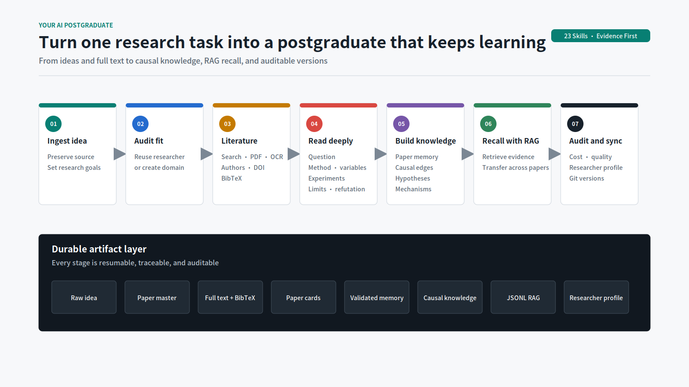
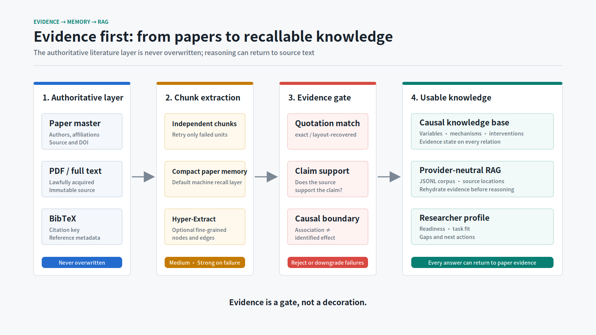
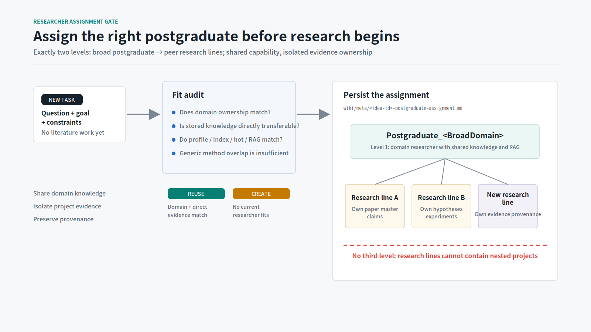

<div align="center">

# Your AI Postgraduate

### Turn every research task into an evidence-grounded AI postgraduate that can remember and keep learning

[](./skills)
[](./requirements.txt)
[](#evidence-is-a-gate-not-a-decoration)
[](#what-you-get)
[](./LICENSE)

<a href="https://github.com/Haoran-98/Your_AI_Postgraduate/raw/main/release/your-ai-postgraduate-skills-v0.2.0.zip"></a>

</div>

<p align="right">
  <a href="./README.md"><kbd>简体中文</kbd></a>
  <a href="./README_EN.md"><kbd><b>English</b></kbd></a>
</p>

[](./docs/assets/system-workflow-en.svg)

`Your AI Postgraduate` is a public Codex Skill ecosystem for long-running academic research. It connects ideas, paper metadata, lawfully acquired full text, strict reading, evidence validation, causal knowledge, RAG, researcher profiling, cost audits, and Git versions into one resumable workflow.

The current release contains **one parent Skill, one shared governance Skill, and 21 operational child Skills**. It publishes generic methods, scripts, and templates only. It contains no private research projects, paper full text, API credentials, or historical request logs.

## Why it exists

Most AI research workflows end with a report. The next question forces the model to rediscover the paper's variables, experiments, counterevidence, and limitations.

This system turns research into durable assets:

- **Remember papers**: preserve authors, affiliations, source, URL, DOI, citation key, and BibTeX;
- **Read the actual paper**: abstracts and search snippets cannot become verified full-text evidence;
- **Remember why**: store questions, methods, variables, datasets, experiments, findings, limits, mechanisms, support, and refutation;
- **Return to sources**: retrieve and rehydrate original evidence before cross-paper reasoning;
- **Choose better work**: profile current strengths, missing evidence, and suitable next research tasks;
- **Control cost**: assign strong, medium, and weak models by task and audit tokens, retries, and failed units;
- **Keep progress**: persist every stage, retry only failed chunks, and version publishable artifacts with Git.

## Install now

### One command

The installer clones the public repository to `$HOME/.local/share/Your_AI_Postgraduate` and safely links all 23 Skills into `${CODEX_HOME:-$HOME/.codex}/skills`. Existing directories are never overwritten.

```bash
curl -fsSL https://raw.githubusercontent.com/Haoran-98/Your_AI_Postgraduate/main/install.sh | sh
```

Restart Codex after installation so the Skills are discovered in a new session.

### Download the Skill Bundle

Download [your-ai-postgraduate-skills-v0.2.0.zip](https://github.com/Haoran-98/Your_AI_Postgraduate/raw/main/release/your-ai-postgraduate-skills-v0.2.0.zip), then run:

```bash
unzip your-ai-postgraduate-skills-v0.2.0.zip
cd Your_AI_Postgraduate
sh install.sh --source "$PWD"
```

Verify the archive:

```bash
curl -fsSLO https://raw.githubusercontent.com/Haoran-98/Your_AI_Postgraduate/main/release/SHA256SUMS
sha256sum -c SHA256SUMS
```

### Install from source

```bash
git clone https://github.com/Haoran-98/Your_AI_Postgraduate.git
cd Your_AI_Postgraduate
sh install.sh --source "$PWD"
```

Use `--copy` when symlinks are unsuitable. Name conflicts require manual review and are never overwritten.

## Start with natural requests

You do not need to memorize the 23 child Skill names. The parent Skill identifies the current stage, enforces gates, and loads only the modules needed for the task.

```text
Audit which existing domain postgraduate fits this research question and persist the assignment before searching literature.
```

```text
Strictly read these papers in full text and preserve BibTeX, variables, experimental design, findings, limitations, support, and counterevidence.
```

```text
Use validated paper memory and RAG to analyze support, refutation, causal mechanisms, and testable hypotheses for this idea.
```

```text
Generate the postgraduate knowledge profile and recommend which research tasks it is currently best prepared to pursue.
```

## Two key designs

### 1. Evidence to RAG

[](./docs/assets/evidence-to-rag-en.svg)

Paper cards, paper masters, full text, and BibTeX form the authoritative literature layer. Compact paper memory is the default machine recall layer; Hyper-Extract is an optional fine-grained extractor. Unmatched quotations, missing endpoints, and unsupported causal strength are rejected or downgraded.

### 2. Researcher assignment and exactly two levels

[](./docs/assets/researcher-routing-en.svg)

Every new task first checks existing profiles, indexes, hot caches, and direct RAG matches. Reuse requires both **domain ownership** and **directly transferable stored knowledge**. Generic method overlap alone is insufficient.

The hierarchy is fixed:

```text
Postgraduate_<BroadDomain>
└── Peer research line
```

Research lines share domain knowledge and RAG infrastructure while keeping separate paper masters, claims, hypotheses, experiments, and evidence provenance. A third project level is not allowed.

## What you get

```text
Postgraduate_<EnglishDomainSlug>/
  .obsidian/                  # Obsidian-ready vault
  .raw/                       # Immutable sources; private by default
  wiki/
    ideas/                    # Traceable idea versions
    research-lines/           # Peer research lines
    papers/                   # Full-text paper cards + BibTeX
    variables/                # Definitions and operationalization
    mechanisms/               # Transferable mechanisms
    claims/                   # Evidence-aware claims
    hypotheses/               # Support, refutation, contrarian tests
    causal-core/              # Causal nodes and edges
    relations/semantic/       # Paper clusters and semantic relations
    profile/                  # HTML / Markdown knowledge profile
  rag/
    corpus.jsonl              # Provider-neutral RAG
    paper-memory/             # Compact resumable paper memories
    postgraduate-profile.json
```

Derived memory, graph, and RAG artifacts never overwrite authors, affiliations, source, URL, DOI, citation key, BibTeX, full-text state, or local evidence paths.

## Skill ecosystem

<details>
<summary><b>Show all 23 Skills</b></summary>

| Skill | Responsibility |
| --- | --- |
| `your-ai-postgraduate` | Identify stages, enforce gates, and coordinate the workflow |
| `postgraduate-common` | Govern naming, evidence, artifacts, privacy, models, and routing |
| `postgraduate-domain-router` | Audit postgraduate fit and route a domain vault |
| `postgraduate-vault-scaffolder` | Create an Obsidian-ready knowledge base |
| `postgraduate-idea-ingestor` | Import one or more IDEA Markdown files |
| `postgraduate-autoresearch` | Produce literature maps and evidence-backed idea variants |
| `postgraduate-literature-search` | Search, screen, expand, and connect scholarly literature |
| `postgraduate-fulltext-acquirer` | Lawfully acquire full text and OCR scanned documents |
| `postgraduate-bibliography-manager` | Preserve and validate BibTeX and citation metadata |
| `postgraduate-deep-reader` | Perform strict full-text reading and causal extraction |
| `postgraduate-paper-memory` | Build compact, resumable, source-grounded paper memories |
| `postgraduate-evidence-validator` | Validate quotations, claims, and causal wording against chunks |
| `postgraduate-causal-builder` | Build variables, mechanisms, claims, hypotheses, and causal bridges |
| `postgraduate-corpus-synthesizer` | Consolidate a paper corpus into durable knowledge pages |
| `postgraduate-relation-builder` | Generate Obsidian relations and semantic paper clusters |
| `postgraduate-rag-builder` | Produce provider-neutral JSONL RAG corpora |
| `postgraduate-rag-reasoner` | Retrieve, rehydrate, and reason across validated evidence |
| `postgraduate-knowledge-profiler` | Visualize knowledge and rank current research-task fit |
| `postgraduate-hyperextract-adapter` | Run optional exhaustive graph extraction and validation |
| `postgraduate-model-tier-controller` | Assign strong, medium, and weak models by task |
| `postgraduate-cost-auditor` | Audit requests, tokens, retries, latency, failures, and budgets |
| `postgraduate-quality-auditor` | Check corpus, evidence, metadata, and RAG readiness |
| `postgraduate-git-sync` | Commit and synchronize permitted artifacts with comments |

</details>

## Run the research scripts

Installing the Skills does not require Python dependencies. Install runtime dependencies only when using the full-text, RAG, OCR, or Hyper-Extract scripts:

```bash
cd "$HOME/.local/share/Your_AI_Postgraduate"
python -m venv .venv
. .venv/bin/activate
python -m pip install --upgrade pip
python -m pip install -r requirements.txt

export YOUR_AI_POSTGRADUATE_HOME="$PWD"
export RESEARCH_ROOT="${RESEARCH_ROOT:-$HOME/auto-research}"
mkdir -p "$RESEARCH_ROOT"
```

Create a domain vault:

```bash
python scripts/scaffold_postgraduate_vault.py \
  --root "$RESEARCH_ROOT" \
  --domain "Example Domain"
```

Build provider-neutral RAG:

```bash
python scripts/prepare_rag_corpus.py \
  --root "$RESEARCH_ROOT" \
  --vault Postgraduate_Example_Domain \
  --fulltext-only
```

Generate a knowledge profile:

```bash
python scripts/generate_postgraduate_profile.py \
  --root "$RESEARCH_ROOT" \
  --vault Postgraduate_Example_Domain \
  --language en
```

## API configuration

Scripts support OpenAI-compatible LLM and embedding endpoints. Copy the blank template and fill it locally. `auth` is ignored by Git.

```bash
cp auth.example auth
set -a
. ./auth
set +a
```

- `OPENAI_MEDIUM_MODEL_ID`: production paper extraction, consolidation, and claim-support review;
- `OPENAI_STRONG_MODEL_ID`: retrieved cross-paper synthesis and research reasoning;
- `OPENAI_WEAK_MODEL_ID`: controlled cost comparisons, disabled for production extraction by default;
- `EMBEDDING_MODEL_ID`: indexing and retrieval that require embeddings.

Production extraction defaults to medium. Escalate to strong only after a recorded medium failure on the same saved unit.

## Evidence is a gate, not a decoration

- `verified-fulltext`: readable full text entered strict reading;
- `blocked`: bibliography and relevance only; cannot support verified claims;
- `exact`: quotation continuously matches the normalized source chunk;
- `layout-recovered`: deterministic token order recovered layout, still requires claim-support review;
- `unmatched`: cannot enter validated memory;
- `machine-reviewed`: model review, not `human-verified`.

Causal language distinguishes `reported_association`, `author_causal_claim`, `identified_causal_effect`, and `mechanistic_hypothesis`. Directed causal edges require a validated source memory.

## Validation and development

```bash
python -m compileall -q scripts tools
python -m pytest -q

for skill in skills/*; do
  python "${CODEX_HOME:-$HOME/.codex}/skills/.system/skill-creator/scripts/quick_validate.py" "$skill"
done

python tools/build_docs_diagrams.py
python scripts/build_skill_bundle.py
```

PNG previews are optional release assets. Install `CairoSVG` and run `python tools/build_docs_diagrams.py --png` to regenerate them.

## Privacy, copyright, and boundaries

The repository never automatically publishes or packages:

- API keys, authorization headers, cookies, or private endpoints;
- private ideas, unpublished drafts, personal notes, or confidential data;
- PDFs and paper full text without redistribution rights;
- model request or response logs containing private source text;
- machine usernames, absolute home paths, or personal research vaults.

Users remain responsible for paper, data, model, and output licenses. This system cannot grant redistribution rights or label machine review as human verification.

## License

Code, Skill instructions, generic templates, and repository-owned documentation use the [MIT License](./LICENSE). Third-party projects and academic materials retain their own licenses and copyright terms.
